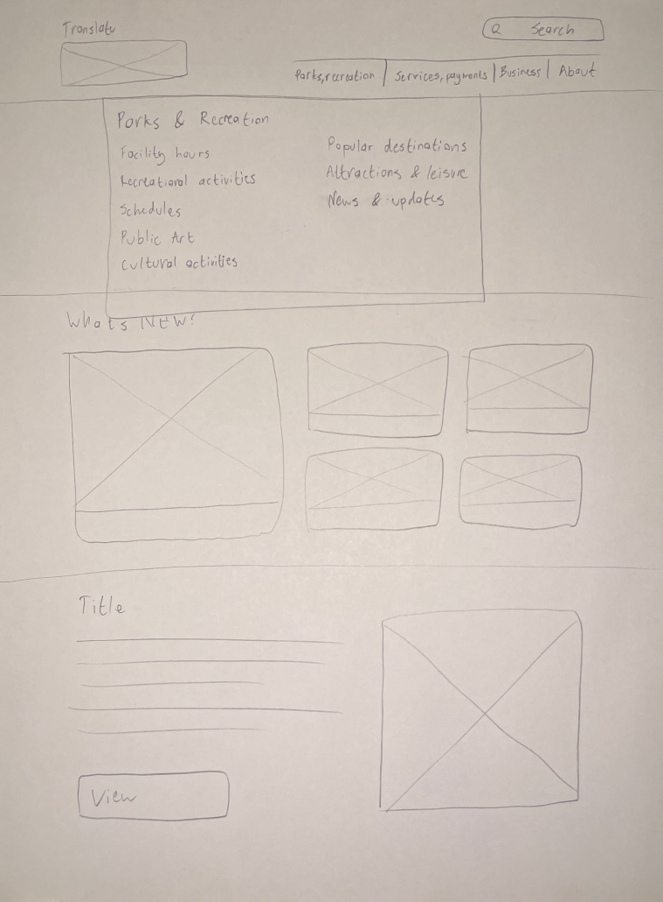
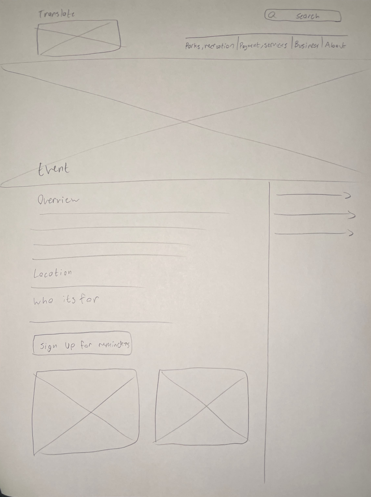

# Wireframes and User Testing

## Learning Overview

Over the course of these two weeks, we learned about creating wireframes and using user testing to improve upon the design. We first went over wireframes and their purpose in the design process. Then, we tested these wireframes with real users trying to complete some of the task flows found in the user scenarios I created earlier, which can be found on the [User-Based Thinking](03_userThinking.md) page.

## Wireframes

Wireframes are rough depictions of what a project's User Interface is supposed to look like. They're often done on paper, to map out what features go where and quickly get a layout that's ready to test and iterate upon.

The main changes I chose to try out was simplifying the design. While many aspects of the original layout work well, and I worked them into my version, I found there were often too many design elements on a page, overwhelming potential users looking for important information. Below, I've attached two sample wireframes I did. The first is a sample home page with the menu open.

The second wireframe below is for an individual event page, which would be found under the Parks and Recreation section found in the above wireframe's menu.

## User Testing

User testing is done to get realistic user feedback on the proposed design of a project. In terms of this project, it was done by giving the tester one of my user scenarios, and having them tell me what they wanted to navigate to on each page. When they chose somewhere to navigate, I would swap out the current wireframe for the one they'd navigated to. This was all done without giving the tester guidance, so I could see how a hypothetical user would treat my design. Below, I've attached some notes I took during the first trial.

> **User Testing Round 1 Notes**  
> **Prompt 1**  
> Hit what's new instead of a menu item  
> Did the rest fine, didn’t take much confusion
>
> **Prompt 2**  
> Hit parks and recreation first  
> User flow is potentially too similar to prompt 1  
> Went much smoother than prompt 1 (confusion from whats new eliminated)
>
> **Prompt 3**  
> Hit business tab (goes nowhere)  
> Found taxes in service/payment quickly  
> Got stuck on the taxes page (unclear on where to go from there, no indicator for business)  
> Got confused on the property tax page  
> Could potentially have a business page that also quick links to taxes to solve this problem?

## Testing Takeaways

After completing 3 trials, I received useful feedback to consider when I moved on to creating a hi-fi prototype. Below, I've attached my main takeaways from the tests.

> **Overall notes**  
> Most confusion came from poorly labelled things  
> Confusion with menu labels, confusion with what headings/subheadings on the pages meant  
> Need to work on redoing information architecture and how to communicate what each page and heading is

Some common problems that came up was confusion in what items were clickable. This happened with the navigation, where the tester would try to click on text or items that weren't clickable. There were also some issues with the information architecture, where the tester went to certain parts of a page, expecting information to be there when it wasn't.

These gave me a good idea for what I needed to change moving forward, both in terms of the visual design as well as what information was prioritized.
