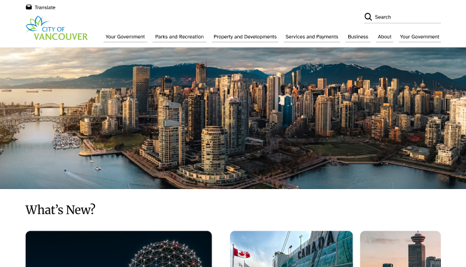
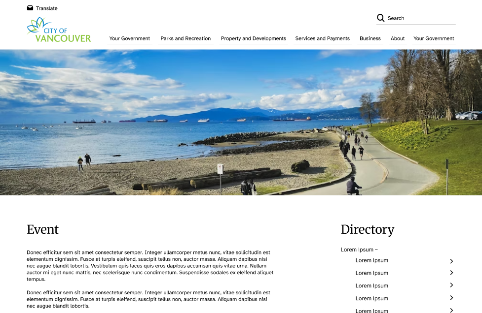
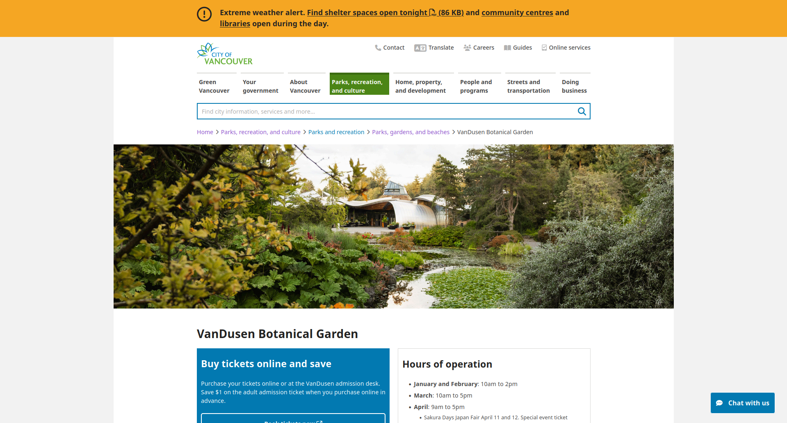

# Hi-fi Prototype and Final Design

## Learning Overview

During this week, we created high fidelity prototypes based on the wireframes I previously created and improved upon through user testing, which can all be found on the [Wireframes and User Testing](05_wireframes.md) page. We also briefly went over usability heuristics.

## Usability heuristics

Nielsen Norman group's [10 Usability Heuristics](https://www.nngroup.com/articles/ten-usability-heuristics/) are a set of guidelines for how to design effective and user friendly layouts. They cover a variety of topics regarding visual design as well as making the layout as user friendly as possible.

## Testing Improvements

After getting user testing feedback on my wireframes, we were tasked to pick a handful of usability heuristics to focus on in the hi-fi prototype. Below, I've attached an excerpt from my redesign rationale.

> **Visibility of System Status**  
> During my user testing, the testers would sometimes get confused about visual feedback regarding if they were on the right page or not. While it wasn’t strictly related to errors, it was also related to being able to tell if the page they were on was the one they wanted. In my lo-fi wireframes, this was partially due to there being no real text. However, this also reflected on the original website, as I often got stuck and had to backtrack, not knowing if I was in the right string of pages to find the right one for my user flows. I plan to implement this with more clear messaging of what’s on the page, as well as a kind of ‘Not what you’re looking for?’ button that gives users a quicker option to return back to where they came from.

Here, Visibility of System Status refers to ensuring that a site makes it clear to the user when there's an error or they've gone to the wrong page. I ended up implementing this through clearer headings, and clearer mouse feedback of what is clickable and isn't.

## Hi-fi Prototype

Hi-fi prototypes are essentially cleaner wireframes. They take the feedback received on a previous iteration, most of the time a paper wireframe, and uses that to move forward and create a more finalized design. I used Figma, a program designed to create mockups for user interfaces and web design.

I'll be showing previews of a few different pages, primarily the same screens seen on the [Wireframes and User Testing](05_wireframes.md) page. The redesign currently uses placeholder Lorem Ipsum text. Below, I've attached screenshots of the finalized home page of my prototype, followed by the original City of Vancouver home page for comparison.

My redesigned version takes elements from the original that worked well, such as the logo and colour palette. However, I used those as a jumping off point to create a new design that would be more friendly to users who were unfamiliar with the site.

The second screen I'll preview here is the single event page, followed by an event page from the original City of Vancouver website for comparison.

{ width="100%" }

While these screenshots don't show the full pages or all created pages, the full product can be viewed in the complete [Figma prototype](https://www.figma.com/proto/Z5nHLRAKMLs8zBaarc6ufR/cityOfVanRedesign?node-id=1-2&t=GtroOXYB6eRw7jm1-1&scaling=min-zoom&content-scaling=fixed&page-id=0%3A1&starting-point-node-id=1%3A2&show-proto-sidebar=1){target="_blank"}. This prototype also has interactivity implemented, allowing for users to navigate through as if it were a real site.
