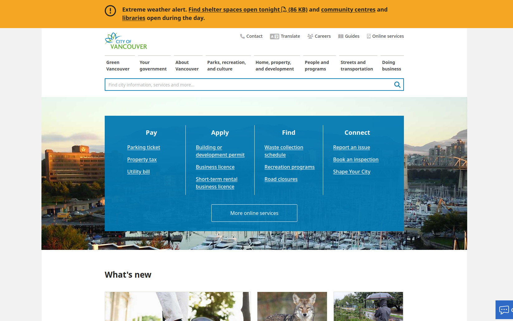

# Week 1 Documentation

_A01454340 Ria Bhullar_.

## What were you tasked to do?

This week, I was tasked to choose a website to redesign or rebuild.

## How did you do it?

As with most projects, I started with brainstorming, covering topics like websites I knew off the top of my head and exploring businesses and websites in the area. I also considered what I wanted out of the project, which will be covered under the _Why did you choose this?_ section.

I mostly relied on internet searches, looking around for local businesses. I prefer to work on concepts that are related to my real life, so even for small businesses I tried to look at those within the Vancouver area.

## What website you choose or idea you created?

The City of Vancouver information website.

## Why you choose this?

I had a few topics in mind when picking a website. Primarily I looked at what would be a good challenge for me, what would be a unique new project for my portfolio, and what I'd personally enjoy.

I've previously taken graphic design courses, and as such have some knowledge when it comes to that area. Having done similar redesigning projects in the past, I didn't want to pick a website that had such a poor design that anyone could pick it out. I wanted to find one that was sufficiently challenging, that looked good to untrained eyes but had problems I could see and solve.

My portfolio already has projects of varying topics, such as creating branding and style guides, overhauling existing UI, and creating UI from scratch. The brands I previously chose for overhauls were mostly small businesses. I like to show variety in my work, so I felt it'd be best I choose a larger scale, more professionally made project to show off more of my skills.

When it comes to personal enjoyment, I try to balance it with what I'd realistically be doing if it were a serious, paid project. While I realistically wouldn't be picking exactly how my projects progress, I wanted a site that would let me still have some fun and creative freedom.

## Are you working alone or in a team. Why?

For this project, I chose to work alone. While I'm comfortable with group work, I feel this best suits me for this project because of the scope of the work. If it were a project where I started from scratch, working in a group would likely feel more time effective and efficient. However, this project is more in terms of a redesign.

Due to that, the scope of work is slightly different. It's more like working with a package already given and trying to improve it, which for me works as a challenge to come up with creative solutions individually. I feel this will help me be able to problem solve on my own and be better suited for contributing to group work in the field.

## What do you hope to get out of these classes?

I hope to take away skills for when it comes to professionally documenting my work progress. I've done self-progress reports before, but always in a casual setting without strict guidelines in terms of what to actually document. As a result, I tended to focus on the personal, more emotional progress on the project. That can be useful in some cases, however for larger scale projects I feel it'll be more important to be able to specify the work I've done and how I've done it as well.
