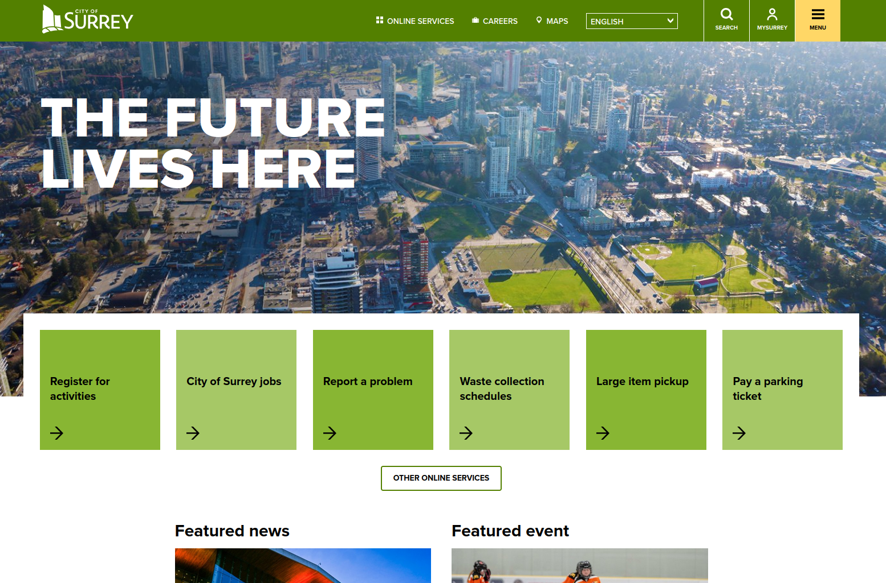
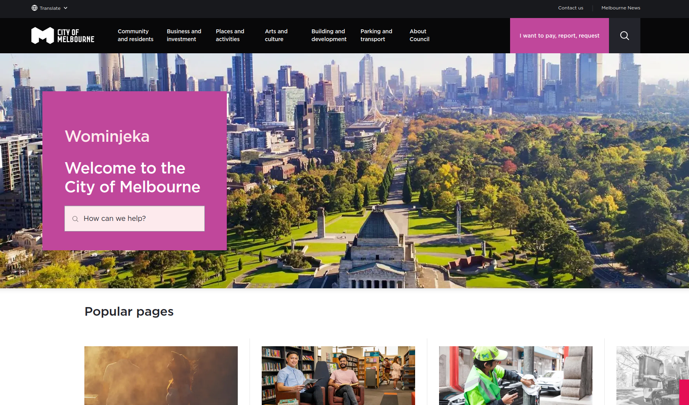

# Week 2 Documentation

## Learning Overview

During our last class, we covered a few topics, as well as doing work for our major project. We covered usability factors and design thinking, which will be covered after this. As well, we worked on doing market and competitor analysis.

### Usability Factors

We covered usability factors in the last class. These are different factors used to measure the functional and aesthetic quality of the website.

    1. Useful
    2. Usable
    3. Findable
    4. Credible
    5. Desirable
    6. Accessible
    7. Valuable

### Design Thinking

Last class, we also learned design thinking. It is a multi step process to find and solve problems in an interface, using empathy and brainstorming as it's main methods.

=== "1. Empathize"
    Putting yourself into the shoes of potential users to identify problems.

=== "2. Define"
    Analyzing and specifically defining the problems from step 1.

=== "3. Ideate"
    Brainstorming as many solutions as you can for these problems, with no limits on logic or functionality.

=== "4. Prototype"
    Choose the best solution and find a way to realistically prototype it.

=== "5. Test"
    Use the prototype as a test to see if it's solved the problem and get feedback.

In terms of where I currently am, I'm on the first step of empathizing. As I'll go over in the next sections, My major progress for this week involves looking into the market and the website itself to find industry standards and existing problems.

## Market Analysis

This analysis was slightly difficult. The market of municipal websites isn't exactly a market on it's own, as they aren't competing to get people to move closer. They're more intended for people that are already in the area and just need more information.

## Competitor Research

I chose to research two other city resource websites. In terms of choosing two that would be most helpful to compare, I ended up picking a local example and a non-local example. With each website, I covered an overview of what the website is and what it's for, as well as what each site did well and what they could improve on.

Finding competitors was slightly difficult. The way a city website is, there isn't direct competition for it's audience. It's simply meant for the people living there, with other cities targeting their populations. As such, I simply chose to compare based on appeal and functionality over comparing them like traditional branded merchandise.

### City of Surrey

I found that the City of Surrey was a suitable competitor in terms of being local and of a similar demographic. The cities of Surrey and Vancouver are very close geographically, and also have shared population and often work together. Below, I've attached an excerpt from my analysis.

> What the City of Surrey website does well is having a more branded and personable appearance. They follow their own style guide quite well, employing different greens to differentiate the quick links in a row while still grouping them together. They also have simple to understand quick links, putting down the most important things first without extra overload. Each interactive element looks and reacts to hovering the same, making the learning curve for users less steep.
>
> However, the website struggles a fair bit with UX. For example, they employ a hamburger menu on the desktop version. On its own, that’s already a poor choice, but the menu requires further clicks to expose topics under each subject, increasing the steps unnecessarily. They also have issues with some HTML elements being visibly unaligned. While that doesn’t overall affect the site’s functionality, it can look unprofessional.

### City of Melbourne

For my second competitor, I chose one that was far more international, but still English speaking, to get an idea for how things are designed and organized outside of North America. Below, I've included an excerpt of my analysis of the City of Melbourne website.

> The City of Melbourne does branding very well. It was difficult to find a file of their style guide, but internally the website is very consistent and pleasant to look at. The starting menu is also executed fairly well, not using many transitions or hovers so that the menu stays on screen when necessary. Each section has its own designated colour, which takes up the header on all information pages for that section. They also often provide other similar or recommended pages which allows for a natural flow through pages.
>
> In terms of what could be improved, the City of Melbourne also suffers from extra clicks to access menus. However, unlike City of Surrey, the original menu drops down as expected. It’s each subsection of the menu that opens a popup from the side that contains further information. This was very overwhelming at first. The website also suffers from some unintuitive or visually unappealing HTML and CSS, such as their not auto-scrolling carousel that is also very difficult to scroll and instead relies on arrow buttons.

## Project Proposal

As of the time of writing this, I only have my proposal half complete. While I've completed competitive analysis, I am yet to finish the actual proposal. I'm currently brainstorming and going through the City of Vancouver website to find the main issues to better phrase my proposal. In terms of what I've already done, I've done a branding based analysis according to the cities existing style guide. I've included an excerpt of what I do have below. In it, I'm discussing the specific usability factors I feel could be improved.

> In terms of desirability, I link it back to the lack of branding on the site. The City of Vancouver style guide details a colour palette of blue, green, and gray. However, the website almost always uses blue, with bits of gray. Adhering more to how city advertising looks with colours and less unapproachability could make the site more appealing to a common user.
As mentioned with the menus, findability is also an issue. Finding a specific topic in the menus themselves is difficult, leading to the search bar being used often. However, the search can also be unreliable at times.
